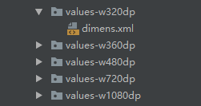

"[TOC]"
# Utils
存放常用的Utils，方便使用。
使用方法：
在root build.gradle(根目录下的)添加:
> maven { url "https://jitpack.io"}
```
allprojects {
    repositories {
        google()
        jcenter()
        maven { url "https://jitpack.io"} //添加的内容
    }
}
```
然后在项目的build.gradle中添加依赖:
> compile 'com.github.shangjianwei:ShangjwUtils:1.08'


#### Adaptive
##### 配置
屏幕适配类。在新建的项目的androidTest下的目录下创建新的Test方法:
````
@Test
    public void buildDemins() throws Exception {
        Adaptive adaptive = new Adaptive();
        adaptive.main();
    }
````
运行之后，我们就会发现项目会创建对应的dimens文件，如图01：

如果您的项目已经关联了SVN或者git等，需要手动将生成的文件add进去。
如下是默认配置，如有需求可以自行修改：
````
    @NonNull
    private double[] dpPath = {320, 360, 480, 720};//需要适配的宽
    private double baseWidth = 360;//默认的宽度
    private double baseHeight = 640;//默认的高度
    private String resPath = "";//res的绝对路径(一般不用改)
````
##### 使用
最后在使用时,所有用到dp的时候使用dp_代替,如:5dp就使用dp_5代替